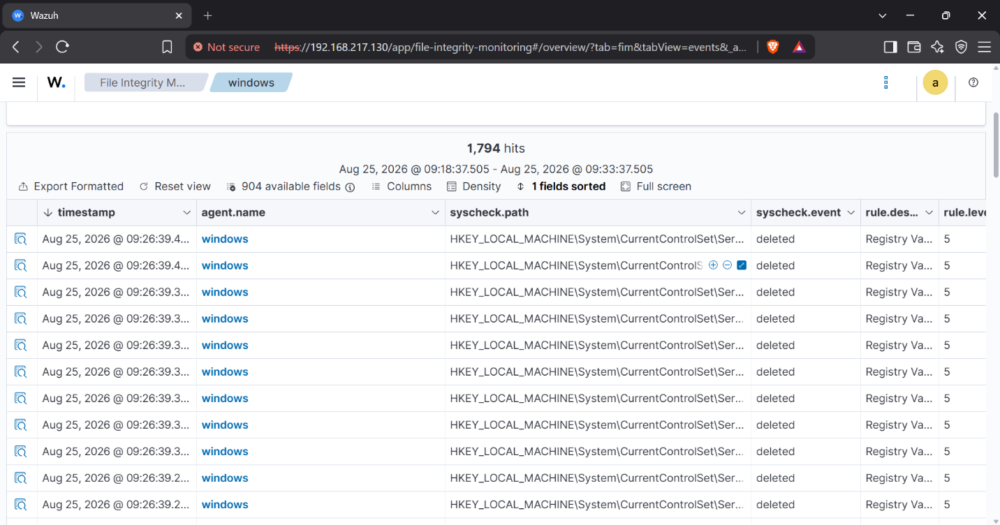
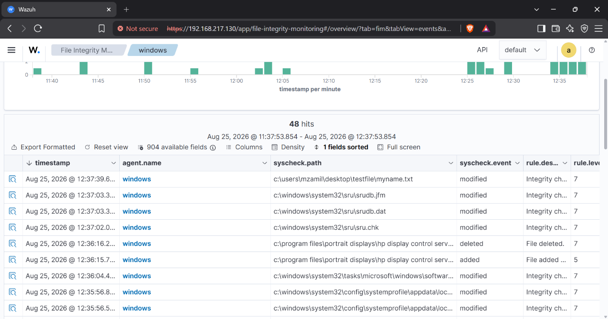
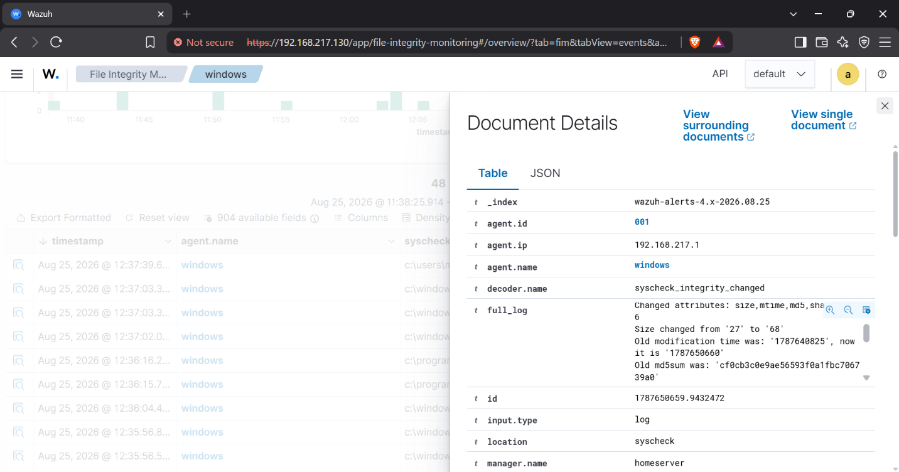

# File Integrity Monitoring (FIM)

Configure Wazuh FIM to detect changes to critical files and directories in real time, with alerting via the Wazuh dashboard.

## What Is FIM?

File Integrity Monitoring tracks checksums, permissions, ownership, and content of watched files. Any modification triggers an alert, giving you visibility into tampering, malware activity, or unauthorized changes.

## Configuration

FIM is configured on the Wazuh manager (or per agent) in `/var/ossec/etc/ossec.conf`. Add the directories you want to watch to the `<syscheck>` block:

```xml
<syscheck>
  <directories check_all="yes">/etc</directories>
  <directories check_all="yes">/root</directories>
  <directories check_all="yes">/home</directories>
</syscheck>
```

Restart the agent after changing the configuration:

```bash
sudo systemctl restart wazuh-agent
```



## Real-Time Alerting

When a watched file changes, Wazuh generates an alert. Alerts appear under **Security events** in the dashboard, tagged with the FIM rule group.






## Testing FIM

1. Modify a watched file, e.g. append to a file under `/etc`:
   ```bash
   sudo echo "test" >> /etc/test-fim.txt
   ```
2. Watch the Wazuh dashboard for the real-time alert (rule group `syscheck`).
3. Investigate the event details: which file changed, when, and from where.

## Key Takeaway

FIM provides real-time visibility into file tampering — a core detection control for compliance frameworks and incident response.
