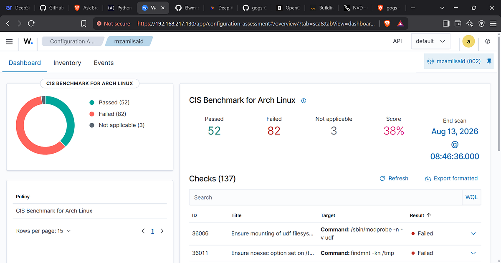
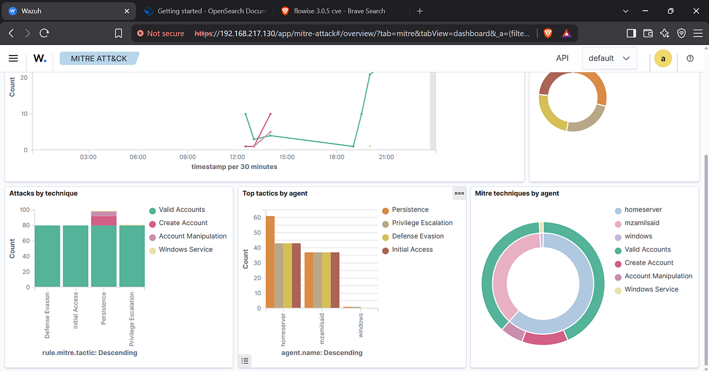
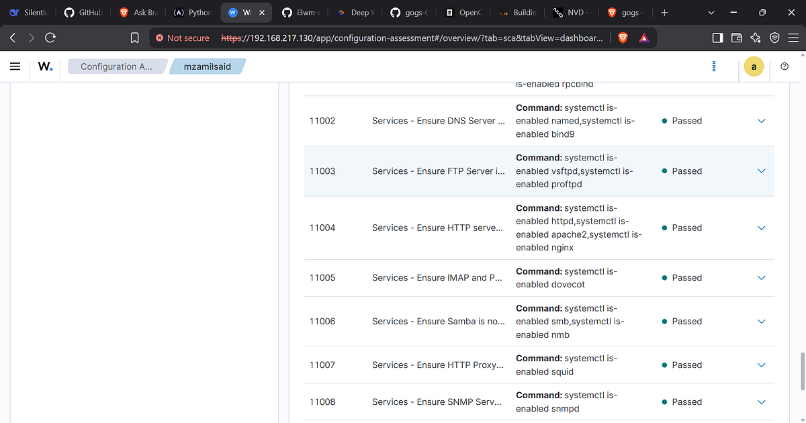
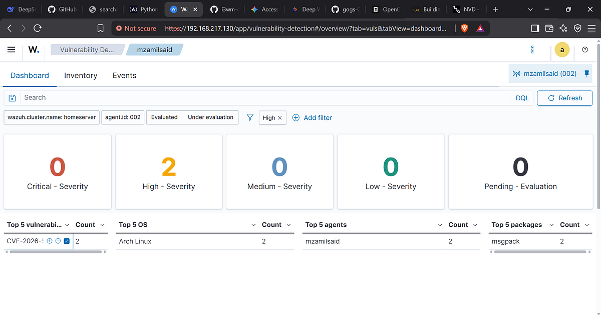
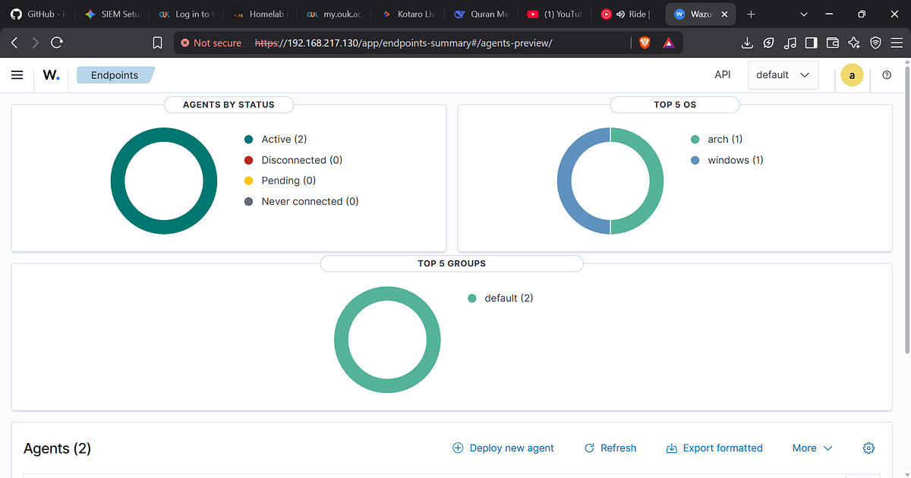
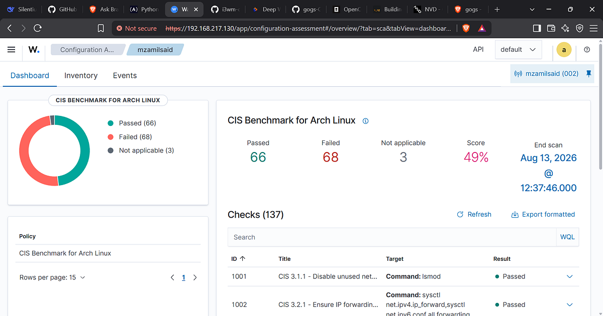
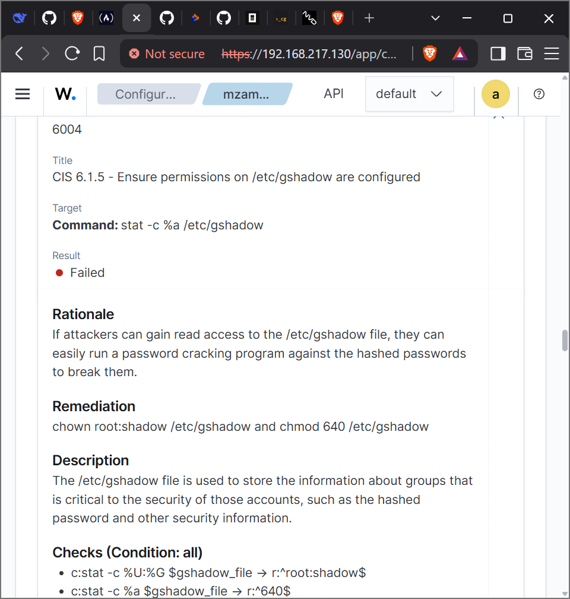
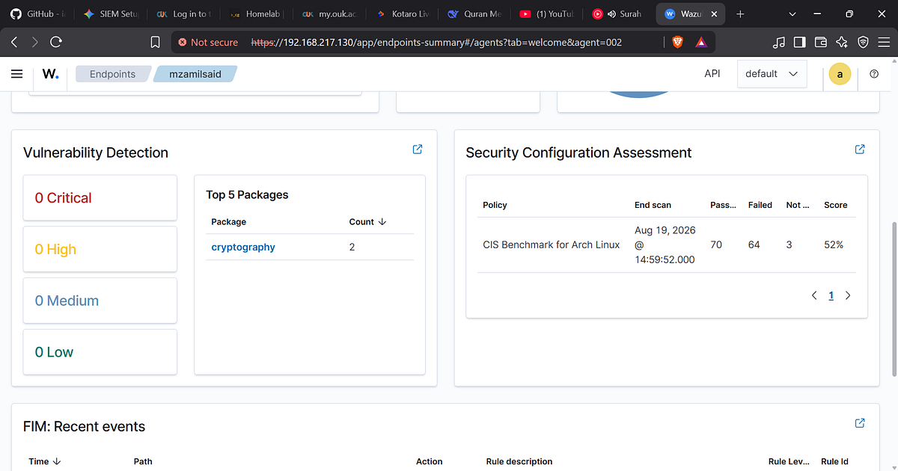

# Building a Wazuh SIEM Homelab: Ubuntu Manager with Arch Linux and Windows 11 Agents

## Architecture Overview

This repository and guide document the complete deployment of a centralized Wazuh SIEM homelab environment. The lab utilizes three main nodes configured across specific local IP addresses:

- **Wazuh Manager / Server:** Ubuntu Server (`192.168.217.131`) hosting the all-in-one Wazuh Indexer, Wazuh Server, and Wazuh Dashboard.
- **Agent 1:** Arch Linux (`192.168.217.130`).
- **Agent 2:** Windows 11 (`192.168.217.1`).



## Part 1: Installing the Wazuh Manager (Ubuntu Server - `192.168.217.131`)

Deploy the centralized all-in-one Wazuh Manager on your Ubuntu server using the official deployment script:

```bash
# Download and run the Wazuh installation assistant
curl -sO https://packages.wazuh.com/4.12/wazuh-install.sh
sudo bash ./wazuh-install.sh -a
```

### Post-Installation Details

- **Dashboard URL:** https://192.168.217.131:443
- **Default Username:** admin
- **Password:** Automatically generated and displayed in your terminal upon completion (make sure to save this securely).



Verify that all essential Wazuh services are running correctly:

```bash
sudo systemctl status wazuh-manager
sudo systemctl status wazuh-dashboard
```

## Part 2: Installing the Wazuh Agent on Windows 11 (`192.168.217.1`)

Automate the agent deployment on your Windows 11 node by executing a PowerShell installation script with administrator privileges.

### PowerShell Script (`install-agent.ps1`)

Create a file named `install-agent.ps1` with the following content:

```powershell
# Define configuration variables
$wazuhAgentVersion = "4.7.5-1"
$wazuhManagerIP = "192.168.217.131"
$wazuhAgentName = "Windows11-PC"
$tempInstallerPath = "$env:TMP\wazuh-agent-$wazuhAgentVersion.msi"

# Step 1: Download the Wazuh agent installer package
Write-Host "Downloading Wazuh agent installer..."
Invoke-WebRequest -Uri "https://packages.wazuh.com/4.x/windows/wazuh-agent-$wazuhAgentVersion.msi" -OutFile $tempInstallerPath

# Step 2: Install the agent silently and link to the manager IP
Write-Host "Installing Wazuh agent..."
msiexec.exe /i $tempInstallerPath /quiet WAZUH_MANAGER=$wazuhManagerIP WAZUH_AGENT_NAME=$wazuhAgentName

# Step 3: Start and configure the Wazuh agent service
Write-Host "Starting Wazuh agent service..."
Start-Service -Name "wazuh-agent"
Set-Service -Name "wazuh-agent" -StartupType Automatic

Write-Host "Installation complete. Checking service status:"
Get-Service -Name "wazuh-agent"
```

Run the script in an **Administrator PowerShell** session:

```powershell
.\install-agent.ps1
```

## Part 3: Installing the Wazuh Agent on Arch Linux (`192.168.217.130`)

Because Arch Linux relies on community repositories, the agent can be compiled and installed via the Arch User Repository (AUR).

### Build and Installation Steps

```bash
# Clone the community PKGBUILD repository
git clone https://github.com/mranv/wazuh-agent-archlinux
cd wazuh-agent-archlinux

# Build and install the package
makepkg -si
```



### Configuring the Agent Connection

Edit the local ossec configuration file to point the agent to your Ubuntu Wazuh Manager:

```bash
sudo nano /var/ossec/etc/ossec.conf
```

Locate the `<client>` block and configure your manager's IP address:

```xml
<client>
  <server>
    <address>192.168.217.131</address>
    <port>1514</port>
    <protocol>tcp</protocol>
  </server>
</client>
```

### Service Management

Enable and start the agent service:

```bash
sudo systemctl enable wazuh-agent
sudo systemctl start wazuh-agent
```

Verify service operation and connectivity logs:

```bash
sudo systemctl status wazuh-agent
sudo tail -f /var/ossec/logs/ossec.log
```

## Part 4: Verification and Dashboard Checks

Once the manager and both endpoint agents are running:

1. Open a browser and access the Wazuh Dashboard at https://192.168.217.131:443.
2. Authenticate using the username `admin` and your deployment password.
3. Navigate to **Management → Agents**.
4. Confirm that both `Windows11-PC` and your Arch Linux client show an **Active** connection state.



| **Component / Task**            | **Command / Action**                             |
| ------------------------------- | ------------------------------------------------ |
| Check Manager Status (Ubuntu)   | `sudo systemctl status wazuh-manager`            |
| Check Dashboard Status (Ubuntu) | `sudo systemctl status wazuh-dashboard`          |
| View Manager Logs               | `sudo tail -f /var/ossec/logs/ossec.log`         |
| Restart Arch Agent              | `sudo systemctl restart wazuh-agent`             |
| Restart Windows Agent           | `Restart-Service -Name "wazuh-agent"` (PowerShell) |

## Additional Screenshots








